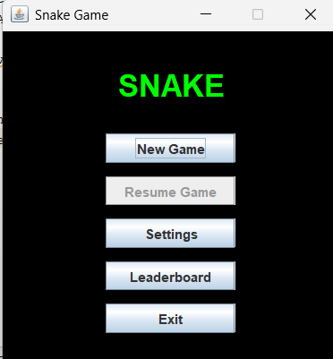
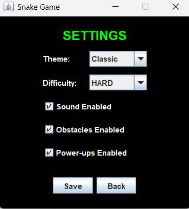
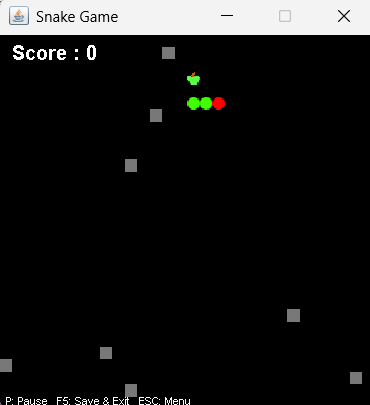
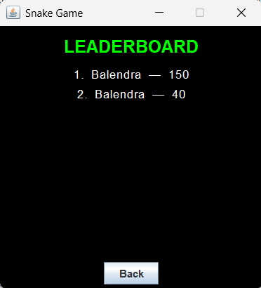
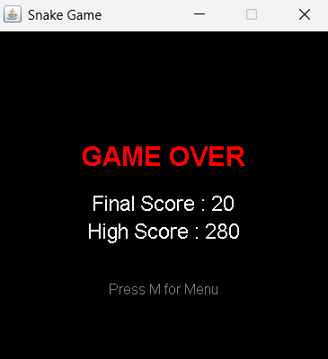

# 🐍 Java Snake Game

A classic Snake Game developed using Java Swing and AWT with modern gameplay features.

## 🚀 Features

- 🎯 Score Counter
- 🏆 High Score Saving
- ⏸ Pause & Resume
- 🔄 Replay after Game Over
- 🔊 Sound Effects
- 🎵 Background Music
- 💥 Collision Detection
- 🎮 Smooth Keyboard Controls

## 🛠 Technologies Used

- Java
- Swing
- AWT
- Object-Oriented Programming

## 🎮 Controls

| Key | Action |
|-----|--------|
| ⬅️⬆️⬇️➡️ | Move Snake |
| P | Pause / Resume |
| Enter | Restart Game |

## ▶️ How to Run

1. Clone the repository
2. Open in NetBeans or IntelliJ IDEA
3. Run `Snake_Game.java`

## 📸 Screenshots

### Main Menu

### Settings

### Pause

### Leaderboard

### Game Over

## 🎥 Gameplay Demo

Download and watch the gameplay video:

[▶️ Gameplay Video](Screenshots/gameplay.mp4)

## 👨‍💻 Author

Balendra Shekhar Dubey
